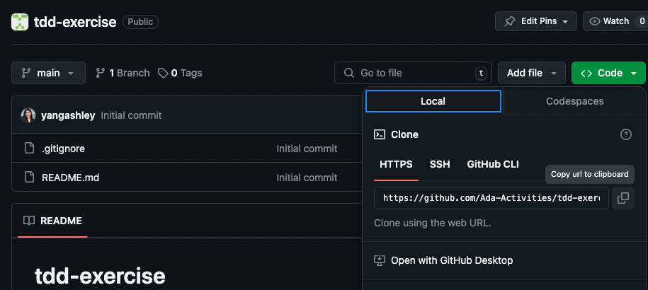

# TDD Exercise
This repository is part of the problem set and class activity for Intro to Tests in Unit 1.

## Learning Goals 
- Practice identifying test cases
- Practice writing tests with pytest
- Practice the Test Driven Development (TDD) programming workflow

## About BlackJack

In this exercise we will write a method and set of tests in TDD fashion which calculates a hand's BlackJack score.

In the card game BlackJack each card has a value.
-  Number cards (2-10) carry the card's numeric value.
-  Face cards on the other hand ("Jack", "Queen", "King") have a value of 10.
-  Aces (1) can have a value of either 1 or 11, whichever will get the hand closest to 21 without going over.

For example if I had a 3, a King, and an Ace, my BlackJack score is 14 (3 + 10 + 1).  If I have an Ace, and a Jack then my score is 21 (11 + 10).

A hand, an array of Card values, must be between 2 and 5 items inclusive.

When a hand's score is greater than 21, the hand is a **bust** and the player automatically loses.

## Problem Set

### Part 1: Identifying Edge & Nominal Cases

Identify some of the following tests cases and record your responses in Learn.

- At least two nominal cases
- At least three edge cases

Note: You should not implement the tests or the functionality in Part 1.

## Classroom Activity

### Part 2: Identifying Edge & Nominal Cases

In class, you will:

1. Review the test cases you identified in Part 1
1. Determine how you would test these cases

### One-Time Problem Set Setup for Part 2

Follow these directions once when you start working on this Part 2 **during roundtables**:

1. Navigate to your projects folder named `projects`

```bash
$ cd ~/Developer/projects
```

1. In Github click on the green "Code" button in Github and then copy the URL. This will allow you to download a copy of this project into your projects folder. This command makes a new folder called `tdd-exercise`, and then puts the project into this new folder. 
   


After copying the URL, run the following command in your terminal:

```
$ git clone <paste your copied URL here>
```

Use `ls` to confirm there's a new project folder

1. Move your location into this project folder

```bash
$ cd tdd-exercise
```

2. Create a virtual environment named `venv` for this project:

```bash
$ python3 -m venv venv
```

3. Activate this environment:

```bash
$ source venv/bin/activate
```

Verify that you're in a python3 virtual environment by running:

- `$ python --version` should output a Python 3 version
- `$ pip --version` should output that it is working with Python 3

4. Install dependencies once at the beginning of this project while your virtual environment is activated. Note that `(venv)` is not part of the command below that you need to run.

```bash
$ (venv) pip install -r requirements.txt
```

### Part 3: Calculating a Score

We will write a method called:  `blackjack_score` which take a list of card values and returns the blackjack score.  The card values can be any of the following, number values 2-10, "King", "Queen", "Jack", and "Ace". For example `blackjack_score(["Ace", 5, 3])` will return 19. If the list contains an invalid card value or the hand contains more than 5 cards, return `"Invalid"`. If the total exceeds 21, return `"Bust"`.  

*Note: These last two cases may be better handled by raising an exception (as opposed to returning `"Invalid"` and `"Bust"`).We can consider that when we learn more about raising exceptions.*

In this exercise we will complete the given tests in `test_blackjack_score.py` and updating the `blackjack_score` function in `main.py` to make it pass.

- Step 1:  Complete the given test and comment out `@pytest.mark.skip`
- Step 2:  Update `blackjack_score` to pass the test. Execute the tests by running the command `pytest` in the terminal.
- Step 3:  Move to the next test

We will likely not have time to write every test and implement every piece of code to implement a complete `blackjack_score` function. Keep in mind that the learning goals for this activity are to practice identifying test cases, practice writing tests with pytest, and practice working in a TDD fashion.